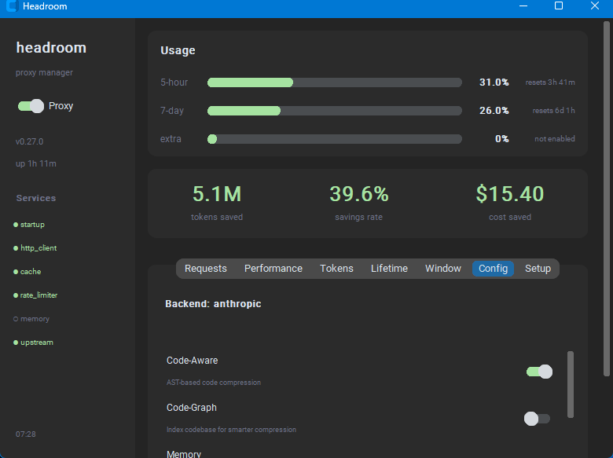
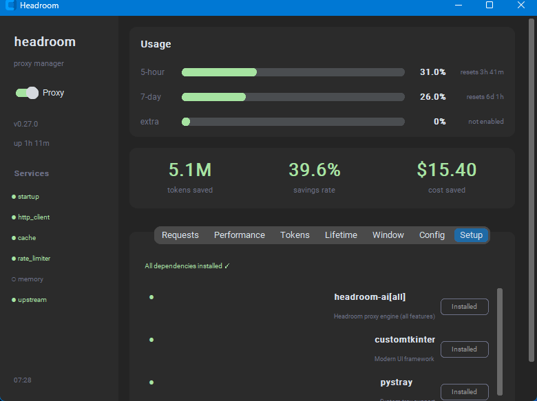

# Headroom Dashboard

Desktop GUI for managing [Headroom](https://headroom-docs.vercel.app) — the context optimization proxy for Claude Code and other LLM tools.

One file. Double-click to run. Dependencies install themselves.


---

## Quick Start

### Prerequisites — Install Python

ต้องมี **Python 3.9+** ติดตั้งในเครื่องก่อน ถ้ายังไม่มี:

**Windows:**
1. ไปที่ https://www.python.org/downloads/
2. ดาวน์โหลด Python 3.12+ แล้วรัน installer
3. **สำคัญ:** ติ๊ก ☑ "Add Python to PATH" ตอน install
4. เปิด terminal ใหม่ ทดสอบ: `python --version`

> ถ้าเจอ "Python was not found" หลัง install — ไปที่ Settings > Apps > Advanced app settings > App execution aliases แล้ว**ปิด** "App Installer python.exe" และ "App Installer python3.exe"

**macOS:**
```bash
brew install python
# หรือดาวน์โหลดจาก https://www.python.org/downloads/
```

**Linux (Ubuntu/Debian):**
```bash
sudo apt update && sudo apt install python3 python3-pip python3-tk
```

**Linux (Fedora):**
```bash
sudo dnf install python3 python3-pip python3-tkinter
```

### Step 1 — Run the app

```bash
python headroom_app.py
```

First launch จะติดตั้ง dependencies อัตโนมัติ (`customtkinter`, `pystray`, `Pillow`) แล้ว restart ตัวเอง

### Step 2 — Install Headroom engine

เปิด app แล้วไปที่ **Setup** tab กด **Install** ที่ `headroom-ai[all]`

หรือติดตั้งเองผ่าน terminal:

```bash
pip install "headroom-ai[all]"
```

### Step 3 — เปิด Proxy

กด **switch Proxy** ใน sidebar เป็น ON — app จะ:
1. เปิด headroom proxy บน `http://127.0.0.1:8787`
2. ตั้ง `ANTHROPIC_BASE_URL` ให้อัตโนมัติ
3. Claude Code session ใหม่จะ route ผ่าน Headroom ทันที

> **Note:** Terminal/IDE ที่เปิดอยู่ก่อน ต้อง restart เพื่อรับ env var ใหม่

---

## UI Overview

App แบ่งเป็น 2 ส่วนหลัก: **Sidebar** (ซ้าย) และ **Main Dashboard** (ขวา)


### Sidebar

| ส่วน | รายละเอียด |
|------|-----------|
| **Proxy Switch** | toggle เปิด/ปิด proxy — เมื่อเปิดจะ start `headroom proxy` และ set env var |
| **Version / Uptime** | เวอร์ชัน proxy และเวลาที่ทำงานมา |
| **Services** | สถานะ internal services — `●` เขียว = healthy, `○` เทา = disabled, `●` แดง = error |
| **Timestamp** | เวลาล่าสุดที่ refresh ข้อมูล |

### Main Dashboard

#### Usage (Progress Bars)

แสดง subscription usage ของ Anthropic API:

| Bar | ความหมาย |
|-----|---------|
| **5-hour** | การใช้งานใน 5 ชั่วโมงล่าสุด — ถ้าเกิน rate limit จะต้องรอ reset |
| **7-day** | การใช้งานรวม 7 วัน |
| **Extra** | ถ้าเปิด extra usage — แสดงยอดเงินที่ใช้ / limit |

สีของ bar:
- **เขียว** = ต่ำกว่า 60% (ปลอดภัย)
- **เหลือง** = 60-80% (เริ่มสูง)
- **แดง** = 80%+ (ใกล้ limit — จะแสดง alert bar ด้านบนด้วย)

#### Savings (Hero Stats)

ตัวเลขใหญ่ 3 ตัวตรงกลาง:

| Stat | ความหมาย |
|------|---------|
| **tokens saved** | จำนวน token ที่ Headroom ลดได้ (เช่น 3.2M = ลดไป 3.2 ล้าน tokens) |
| **savings rate** | เปอร์เซ็นต์ที่ลด (เช่น 40.1% = ทุก 100 tokens ลดได้ 40) |
| **cost saved** | เงินที่ประหยัดได้ (คำนวณจาก token price ของแต่ละ model) |

#### Tabs

| Tab | แสดงอะไร |
|-----|---------|
| **Requests** | จำนวน request ทั้งหมด, cached, rate limited, failed |
| **Performance** | TTFB (Time to First Byte), overhead ที่ proxy เพิ่ม, latency |
| **Tokens** | รายละเอียด input/output/saved tokens + breakdown ตาม compression type |
| **Lifetime** | สถิติสะสมตลอดการใช้งาน + session ปัจจุบัน |
| **Window** | Token breakdown ของ subscription window — input, output, cache reads/writes, แยกตาม model |
| **Config** | ตั้งค่า proxy features (ดูหัวข้อ Configuration) |
| **Setup** | ติดตั้ง dependencies (ดูหัวข้อ Setup Tab) |

---

## Configuration



ใน **Config** tab สามารถเปิด/ปิด features ของ proxy ได้:

| Feature | Default | ทำอะไร |
|---------|---------|--------|
| **Code-Aware** | ON | ใช้ AST (Abstract Syntax Tree) ในการ compress code — เข้าใจโครงสร้างภาษา ไม่ตัดส่วนสำคัญ |
| **Code-Graph** | OFF | Index codebase ทั้งโปรเจกต์ เพื่อให้ compression ฉลาดขึ้น ต้องเปิด proxy จาก project root |
| **Memory** | OFF | จำ context ข้าม session — ใช้ SQLite local หรือ Qdrant |
| **Learn** | OFF | เรียนรู้จาก error patterns ใน traffic เพื่อป้องกันซ้ำ (ต้องเปิด Memory ด้วย) |
| **Optimize** | ON | เปิด compression หลัก — ปิดจะเป็น passthrough mode |
| **Cache** | ON | Semantic caching — request ซ้ำจะตอบจาก cache |
| **Rate Limit** | ON | ป้องกัน rate limit จาก API provider |
| **Kompress** | ON | ML-based compression engine — ตัวหลักที่ลด tokens |

เมื่อเปลี่ยนค่า:
- ค่าจะ **บันทึกอัตโนมัติ** ลง config file
- ถ้า proxy ทำงานอยู่ จะแสดงปุ่ม **Apply & Restart** สีเหลือง — กดเพื่อ restart proxy ด้วย settings ใหม่
- ถ้า proxy ยังไม่เปิด — เปิดครั้งหน้าจะใช้ settings ที่ตั้งไว้เลย

ด้านล่างมีปุ่ม:
- **Config file** — เปิด File Explorer ไปที่ config file
- **App folder** — เปิด File Explorer ไปที่ตัว app

---

## Setup Tab



สำหรับติดตั้ง dependencies ผ่าน GUI:

| Package | ทำไมต้องมี |
|---------|-----------|
| **headroom-ai[all]** | Proxy engine + ทุก feature (code-aware, memory, learn, ast-grep) |
| **customtkinter** | UI framework ของ app นี้ |
| **pystray** | ย่อลง system tray |
| **Pillow** | สร้าง icon สำหรับ tray |

แต่ละ package แสดง:
- `●` เขียว + "Installed" = ติดตั้งแล้ว
- `○` แดง + ปุ่ม "Install" = ยังไม่มี กดเพื่อติดตั้ง

การติดตั้ง headroom-ai[all] จะได้ bundled tools เพิ่ม:

| Tool | ทำอะไร | ติดตั้งเพิ่ม |
|------|--------|-------------|
| **ast-grep** | AST-aware structural search (มากับ pip) | ไม่ต้อง |
| **difft** | Structural diff | `headroom tools install` |
| **scc** | Lines-of-code / repo shape analysis | `headroom tools install` |

---

## Rate Limit Alert

เมื่อ 5-hour usage เกิน 80%:

1. **Alert bar สีแดง** โผล่ด้านบนของ dashboard — แสดงเปอร์เซ็นต์และเวลาที่จะ reset
2. **Tray notification** — ถ้า app ย่อลง tray จะส่ง popup notification เตือน (เตือนครั้งเดียวต่อรอบ)
3. **Progress bar เป็นสีแดง** ใน Usage section

เมื่อ usage ลงต่ำกว่า 80% — alert หายไปอัตโนมัติ

---

## System Tray

- กดปุ่ม **X** (ปิดหน้าต่าง) จะ **ย่อลง tray** ไม่ใช่ปิด app — proxy ยังทำงานอยู่และ app ยังคง monitor
- **Double-click** ที่ tray icon จะเปิดหน้าต่างกลับมา
- **คลิกขวา** ที่ tray icon:
  - **Show** — เปิดหน้าต่าง
  - **Quit** — ปิด app จริง (proxy ยังทำงานต่อ)

> ถ้าไม่มี `pystray` + `Pillow` ติดตั้ง — กด X จะปิด app ปกติแทน

---

## Platform Support

| OS | GUI App | CLI Scripts |
|----|---------|-------------|
| Windows | Full support | `headroom.ps1` / `headroom.bat` |
| macOS | Full support | — |
| Linux | Full support (ต้องมี tkinter) | — |

### Config file location

| OS | Path |
|----|------|
| Windows | `%APPDATA%\headroom-app\config.json` |
| macOS | `~/Library/Application Support/headroom-app/config.json` |
| Linux | `~/.config/headroom-app/config.json` |

### Platform-specific behavior

| การทำงาน | Windows | macOS / Linux |
|---------|---------|---------------|
| Kill proxy | `taskkill /PID` | `os.kill` (SIGTERM → SIGKILL) |
| Set env var | `setx` (registry) | append to `~/.zshrc` / `~/.bashrc` |
| Open file | `explorer /select,` | `open -R` / `xdg-open` |
| Hide console | `CREATE_NO_WINDOW` | ไม่จำเป็น |

---

## Files

| File | จำเป็น | รายละเอียด |
|------|--------|-----------|
| `headroom_app.py` | ใช่ | ตัว app หลัก — ไฟล์เดียวที่ต้องใช้ |
| `headroom.ps1` | ไม่ | PowerShell CLI wrapper สำหรับ Windows |
| `headroom.bat` | ไม่ | Batch CLI wrapper สำหรับ Windows |

หากต้องการใช้บนเครื่องอื่น **copy แค่ `headroom_app.py` ไฟล์เดียว** แล้ว `python headroom_app.py`

---

## How It Works

```
Claude Code  ──►  Headroom Proxy (localhost:8787)  ──►  Anthropic API
                         │
                    compress context
                    cache responses
                    track usage
                         │
                  Headroom Dashboard  ◄── GET /health
                    (this app)        ◄── GET /stats
```

1. **Headroom Proxy** รับ request จาก Claude Code แล้ว compress context ก่อนส่งไป Anthropic API
2. **Dashboard** ดึงข้อมูลจาก proxy ผ่าน HTTP API ทุก 3 วินาที:
   - `GET /health` — สถานะ proxy, version, services, config
   - `GET /stats` — token savings, cost, requests, subscription usage, performance
3. **Environment variable** `ANTHROPIC_BASE_URL=http://127.0.0.1:8787` ทำให้ Claude Code route traffic ผ่าน proxy อัตโนมัติ

---

## Troubleshooting

| ปัญหา | แก้ไข |
|-------|------|
| App เปิดแล้วเห็นแต่ "Setting up..." | รอให้ pip install เสร็จ ถ้า fail ดู error message แล้วรัน `pip install customtkinter` เอง |
| Proxy เปิดแล้วแต่ Claude Code ไม่ผ่าน Headroom | Restart terminal/IDE หลังเปิด proxy เพื่อรับ env var ใหม่ |
| "headroom not found" ตอนกด ON | ไป Setup tab กด Install ที่ headroom-ai[all] หรือรัน `pip install "headroom-ai[all]"` |
| Dashboard แสดง 0 ทุกที่ | ยังไม่มี request ผ่าน proxy — ใช้ Claude Code แล้วข้อมูลจะขึ้น |
| Port 8787 ถูกใช้งานอยู่แล้ว | ปิด process ที่ใช้ port นั้น หรือแก้ `PROXY_PORT` ใน headroom_app.py |
| Linux: `tkinter` not found | ติดตั้ง: `sudo apt install python3-tk` (Ubuntu/Debian) หรือ `sudo dnf install python3-tkinter` (Fedora) |
