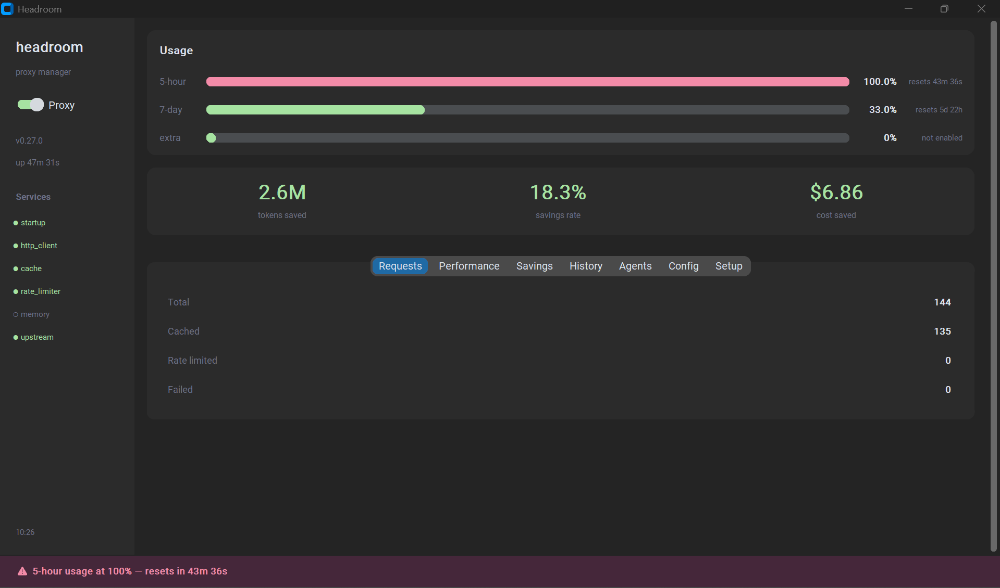

# Headroom Dashboard

Desktop GUI for managing [Headroom](https://headroom-docs.vercel.app) — the context optimization proxy for Claude Code.

> **Note:** รองรับเฉพาะ **Claude (Anthropic API)** — ยังไม่รองรับ OpenAI, Gemini หรือ provider อื่น

Single file. Double-click to run. Dependencies install themselves.



---

## Table of Contents

- [Quick Start](#quick-start)
- [UI Overview](#ui-overview)
- [Tabs Reference](#tabs-reference)
- [Configuration](#configuration)
- [Setup Tab](#setup-tab)
- [Rate Limit Alert](#rate-limit-alert)
- [System Tray](#system-tray)
- [Architecture](#architecture)
- [Developer Guide](#developer-guide)
- [Platform Support](#platform-support)
- [Troubleshooting](#troubleshooting)

---

## Quick Start

### Prerequisites

| ซอฟต์แวร์ | เวอร์ชันขั้นต่ำ | หมายเหตุ |
|-----------|---------------|---------|
| **Python** | 3.9+ | ต้องติดตั้งก่อนใช้งาน |
| **Rust** | 1.88+ | ใช้ build headroom-ai (app ติดตั้งให้อัตโนมัติ) |
| **tkinter** | — | มาพร้อม Python บน Windows/macOS; Linux ต้อง `apt install python3-tk` |

<details>
<summary>วิธีติดตั้ง Python (คลิกเพื่อดู)</summary>

**Windows:**
1. ดาวน์โหลดจาก https://www.python.org/downloads/
2. ติ๊ก ☑ **"Add Python to PATH"** ตอน install
3. เปิด terminal ใหม่ ทดสอบ: `python --version`

> ถ้าเจอ "Python was not found" — ไปที่ Settings > Apps > Advanced app settings > App execution aliases แล้ว**ปิด** "App Installer python.exe" และ "App Installer python3.exe"

**macOS:**
```bash
brew install python
```

**Linux (Ubuntu/Debian):**
```bash
sudo apt update && sudo apt install python3 python3-pip python3-tk
```

**Linux (Fedora):**
```bash
sudo dnf install python3 python3-pip python3-tkinter
```
</details>

### Step 1 — Run

```bash
python headroom_app.py
```

ครั้งแรกจะเปิดหน้าต่าง bootstrap ติดตั้ง `customtkinter`, `pystray`, `Pillow` อัตโนมัติ แล้ว restart เข้า app หลัก

### Step 2 — Setup Everything

App จะสลับไปหน้า **Setup** อัตโนมัติ กดปุ่ม **Setup Everything** เพื่อ:

1. ตรวจสอบ/ติดตั้ง/อัปเดต **Rust Compiler** (ต้องการ v1.88+)
2. ติดตั้ง **headroom-ai[all]** และ dependencies ทั้งหมด

ระหว่างติดตั้งจะแสดง progress bar และ terminal log แบบ real-time

<details>
<summary>ติดตั้ง manual ผ่าน terminal</summary>

```bash
# ติดตั้ง/อัปเดต Rust
curl --proto '=https' --tlsv1.2 -sSf https://sh.rustup.rs | sh   # Linux/macOS
# หรือ https://win.rustup.rs/x86_64 สำหรับ Windows

rustup update stable

# ติดตั้ง headroom
pip install "headroom-ai[all]"
```
</details>

### Step 3 — เปิด Proxy

กด **switch Proxy** ใน sidebar เป็น ON — app จะ:

1. เปิด headroom proxy บน `http://127.0.0.1:8787`
2. ตั้ง `ANTHROPIC_BASE_URL` ให้อัตโนมัติ (persist ข้าม session)
3. Claude Code session ใหม่จะ route ผ่าน Headroom ทันที

> **Windows:** หลังเปิดหรือปิด proxy ต้อง **ปิดแล้วเปิด VS Code / terminal ใหม่** เพื่อรับ env var ล่าสุด (ไม่ต้อง log out/log in)
> macOS/Linux: เปิด terminal ใหม่ก็พอ

---

## UI Overview

App แบ่งเป็น 2 ส่วน: **Sidebar** (ซ้าย) และ **Main Dashboard** (ขวา)

### Sidebar

| ส่วน | รายละเอียด |
|------|-----------|
| **Proxy Switch** | เปิด/ปิด proxy — set env var + start/stop process |
| **Hint Label** | (Windows) แสดงคำแนะนำให้ restart VS Code / terminal หลังเปิด/ปิด proxy |
| **Version / Uptime** | เวอร์ชัน proxy และเวลาที่ทำงานมา |
| **Services** | สถานะ internal services — `●` เขียว = healthy, `○` เทา = disabled, `●` แดง = error |
| **Timestamp** | เวลาล่าสุดที่ refresh ข้อมูล |

### Usage Bars (Progress Bars)

แสดง subscription usage ของ Anthropic API:

| Bar | ความหมาย |
|-----|---------|
| **5-hour** | การใช้งานใน 5 ชั่วโมงล่าสุด — เกิน limit ต้องรอ reset |
| **7-day** | การใช้งานรวม 7 วัน |
| **Extra** | extra usage (ถ้าเปิด) — แสดงยอดเงิน / limit |

สีของ bar: **เขียว** (<60%) → **เหลือง** (60-80%) → **แดง** (>80% + alert)

### Hero Stats

ตัวเลขใหญ่ 3 ตัวตรงกลาง:

| Stat | ความหมาย |
|------|---------|
| **tokens saved** | จำนวน token ที่ลดได้ (เช่น 3.2M = 3.2 ล้าน tokens) |
| **savings rate** | เปอร์เซ็นต์ที่ลด (เช่น 40.1% = ทุก 100 tokens ลดได้ 40) |
| **cost saved** | เงินที่ประหยัดได้ (คำนวณจาก token price) |

---

## Tabs Reference

### Requests

| Field | Source | ความหมาย |
|-------|--------|---------|
| Total | `stats.requests.total` | จำนวน request ทั้งหมดที่ผ่าน proxy |
| Cached | `stats.requests.cached` | request ที่ตอบจาก cache |
| Rate limited | `stats.requests.rate_limited` | request ที่ถูก rate limit |
| Failed | `stats.requests.failed` | request ที่ล้มเหลว |

### Performance (two-column)

| Column | Field | Source | ความหมาย |
|--------|-------|--------|---------|
| **LATENCY** | TTFB avg | `stats.ttfb.average_ms` | Time to First Byte เฉลี่ย |
| | TTFB range | `stats.ttfb.min_ms` – `max_ms` | ช่วง min-max ของ TTFB |
| | Overhead | `stats.overhead.average_ms` | เวลาที่ proxy เพิ่มเข้ามา |
| | Latency | `stats.latency.average_ms` | latency รวมทั้งหมด |
| **THROUGHPUT** | Gen p50 | `stats.throughput.rolling.generation_p50` | output generation speed (tok/s) |
| | Gen p95 | `stats.throughput.rolling.generation_p95` | p95 ของ generation speed |
| | Comp p50 | `stats.throughput.rolling.compression_p50` | compression speed (tok/s) |
| | Comp p95 | `stats.throughput.rolling.compression_p95` | p95 ของ compression speed |

### Savings

| Section | Field | Source | ความหมาย |
|---------|-------|--------|---------|
| **Tokens** | Input | `stats.tokens.input` | input tokens ทั้งหมด |
| | Output | `stats.tokens.output` | output tokens ทั้งหมด |
| | Saved | `stats.tokens.all_layers_saved` | tokens ที่ลดได้ |
| | Compression | `stats.tokens.proxy_compression_saved` | จาก compression |
| | CLI filtering | `stats.tokens.cli_filtering_saved` | จาก CLI filtering |
| **Cost** | Without proxy | `stats.cost.without_headroom_usd` | ค่าใช้จ่ายถ้าไม่มี proxy |
| | With proxy | `stats.cost.with_headroom_usd` | ค่าใช้จ่ายจริงผ่าน proxy |
| | Cache savings | `stats.cost.breakdown.cache_savings_usd` | เงินที่ประหยัดจาก caching |

### History (two-column)

| Column | Section | Field | Source |
|--------|---------|-------|--------|
| **Left** | SESSION | Requests | `stats.display_session.requests` |
| | | Saved | `stats.display_session.tokens_saved` |
| | ALL TIME | Requests | `stats.persistent_savings.lifetime.requests` |
| | | Tokens saved | `stats.persistent_savings.lifetime.tokens_saved` |
| | | Savings | `stats.persistent_savings.lifetime.compression_savings_usd` |
| **Right** | WINDOW | Input | `stats.subscription_window.window_tokens.input` |
| | | Output | `stats.subscription_window.window_tokens.output` |
| | | Cache reads | `stats.subscription_window.window_tokens.cache_reads` |
| | | Total | `stats.subscription_window.window_tokens.total_raw` |
| | EFFICIENCY | Rate | `stats.subscription_window.contribution.efficiency_pct` |

Model breakdown แสดงด้านล่าง แยกตาม model ที่ใช้

### Agents

| Field | Source | ความหมาย |
|-------|--------|---------|
| Total requests | `stats.agent_usage.totals.requests` | request ทั้งหมดจากทุก agent |
| Tokens saved | `stats.agent_usage.totals.tokens_saved` | tokens ที่ลดได้รวม |
| Savings rate | `stats.agent_usage.totals.savings_percent` | อัตราการลดรวม |

ด้านล่างเป็น scrollable list แสดง per-agent: ชื่อ agent, จำนวน requests, tokens saved

### Config

ดูหัวข้อ [Configuration](#configuration)

### Setup

ดูหัวข้อ [Setup Tab](#setup-tab)

---

## Configuration

ใน **Config** tab เปิด/ปิด features ของ proxy:

| Feature | Default | ทำอะไร |
|---------|---------|--------|
| **Code-Aware** | ON | ใช้ AST ในการ compress code — เข้าใจโครงสร้างภาษา |
| **Code-Graph** | OFF | Index codebase ทั้งโปรเจกต์ เพื่อให้ compression ฉลาดขึ้น |
| **Memory** | OFF | จำ context ข้าม session (SQLite local / Qdrant) |
| **Learn** | OFF | เรียนรู้จาก error patterns (ต้องเปิด Memory ด้วย) |
| **Optimize** | ON | เปิด compression หลัก — ปิดจะเป็น passthrough mode |
| **Cache** | ON | Semantic caching — request ซ้ำจะตอบจาก cache |
| **Rate Limit** | ON | ป้องกัน rate limit จาก API provider |
| **Kompress** | ON | ML-based compression engine |

เมื่อเปลี่ยนค่า:
- บันทึกอัตโนมัติลง config file
- ถ้า proxy ทำงานอยู่ → ปุ่ม **Apply & Restart** สีเหลือง → กดเพื่อ restart
- ถ้า proxy ปิดอยู่ → เปิดครั้งหน้าจะใช้ settings ใหม่

---

## Setup Tab

### System Tools

| Tool | ความต้องการ | ทำอะไร |
|------|------------|--------|
| **Rust Compiler** | v1.88+ | ใช้ build headroom-ai จาก source |

แสดงสถานะ: version ที่ตรวจพบ, ปุ่ม Install/Update ถ้าจำเป็น

### Python Packages

| Package | ทำไมต้องมี |
|---------|-----------|
| **headroom-ai[all]** | Proxy engine + ทุก feature |
| **customtkinter** | UI framework |
| **pystray** | ย่อลง system tray |
| **Pillow** | สร้าง icon สำหรับ tray |

แสดงสถานะ: `●` เขียว = ติดตั้งแล้ว, `○` แดง = ยังไม่มี

### ปุ่ม Setup Everything

กดครั้งเดียว ติดตั้ง/อัปเดตทุกอย่างที่ขาดตามลำดับ: Rust → Python packages
พร้อม progress bar และ terminal log แบบ real-time

### Bundled Tools (หลังติดตั้ง headroom-ai)

| Tool | ทำอะไร | ติดตั้งเพิ่ม |
|------|--------|-------------|
| **ast-grep** | AST-aware structural search | มากับ pip |
| **difft** | Structural diff | `headroom tools install` |
| **scc** | Lines-of-code analysis | `headroom tools install` |

---

## Rate Limit Alert

เมื่อ 5-hour usage เกิน 80%:

1. **Alert bar สีแดง** ด้านบน dashboard — แสดง % และเวลา reset
2. **Tray notification** (ถ้าย่อลง tray) — เตือนครั้งเดียวต่อรอบ
3. **Progress bar สีแดง** ใน Usage section

เมื่อ usage ลงต่ำกว่า 80% → alert หายไปอัตโนมัติ

---

## System Tray

- กด **X** (ปิดหน้าต่าง) → ย่อลง tray ไม่ใช่ปิด app — proxy ยังทำงาน
- ย่อลง tray จะแสดง **notification** "Headroom is still running in the tray." เตือนทุกครั้ง
- **Double-click** tray icon → เปิดหน้าต่างกลับ
- **คลิกขวา** → Show / Quit
- ถ้าไม่มี `pystray` + `Pillow` → กด X จะปิด app ปกติ

### Single Instance

App ป้องกันการเปิดซ้ำ — ถ้าเปิด `headroom_app.py` ขณะที่มี instance ทำงานอยู่แล้ว (รวมถึงที่ย่อลง tray) จะแสดง dialog "Headroom is already running. Check the system tray." แทนการเปิด instance ใหม่

| OS | กลไก |
|----|------|
| Windows | Named Mutex (`Global\HeadroomAppMutex`) |
| macOS / Linux | File lock (`fcntl.flock`) |

---

## Architecture

### System Diagram

```
Claude Code  ──►  Headroom Proxy (localhost:8787)  ──►  Anthropic API
                         │
                    compress context
                    cache responses
                    track usage
                         │
                  Headroom Dashboard  ◄── GET /health
                    (this app)        ◄── GET /stats  (every 3s)
```

### Data Flow

1. **Headroom Proxy** รับ request จาก Claude Code → compress context → ส่งไป Anthropic API
2. **Dashboard** poll proxy ผ่าน HTTP ทุก 3 วินาที:
   - `GET /health` — สถานะ, version, services, config
   - `GET /stats` — tokens, cost, requests, subscription, performance, agents
3. **Environment variable** `ANTHROPIC_BASE_URL=http://127.0.0.1:8787` ทำให้ Claude Code route ผ่าน proxy

---

## Developer Guide

### Project Structure

```
headroom-dashboard/
├── headroom_app.py      # ตัว app ทั้งหมด (single file)
├── headroom.bat          # Batch CLI wrapper (Windows)
├── README.md
└── screenshots/
```

ออกแบบเป็น **single-file app** — ไม่ต้อง setup project, ไม่มี build step, copy ไฟล์เดียวแล้วรันได้

### Code Architecture

```
headroom_app.py
├── Bootstrap (_bootstrap)          # auto-install UI deps on first run
├── Constants & Helpers
│   ├── _find_headroom_exe()        # locate headroom binary
│   ├── fetch_json(path)            # HTTP GET from proxy
│   ├── deep(d, *keys)              # safe nested dict access
│   ├── fmt_tokens(n)               # format: 1500000 → "1.5M"
│   ├── fmt_usd(v)                  # format: 2.39 → "$2.39"
│   ├── fmt_rate(v)                 # format: 98.28 → "98 tok/s"
│   └── fmt_duration(sec)           # format: 3661 → "1h 1m"
├── Single Instance Lock
│   └── _acquire_instance_lock()    # Named Mutex (Windows) / fcntl (Unix)
├── Platform Helpers
│   ├── _broadcast_env_change()     # WM_SETTINGCHANGE broadcast (Windows)
│   ├── _set_env_persistent()       # set env var (winreg / shell rc)
│   ├── _unset_env_persistent()     # remove env var
│   └── _open_in_explorer()         # open file in OS file manager
└── HeadroomApp (CTk)
    ├── __init__                    # window setup, build UI
    ├── _build_sidebar()            # proxy switch, status, services
    ├── _build_main()               # usage bars, hero stats, tabs
    │   ├── Requests tab
    │   ├── Performance tab         # two-column: Latency + Throughput
    │   ├── Savings tab             # tokens + cost breakdown
    │   ├── History tab             # two-column: Session/Lifetime + Window/Efficiency
    │   ├── Agents tab              # totals + scrollable per-agent list
    │   ├── Config tab              # proxy feature switches
    │   └── Setup tab               # Rust + Python deps + Install All
    ├── _build_alert_bar()          # rate limit alert overlay
    ├── Lifecycle
    │   ├── _cleanup_env()          # remove stale env vars on exit
    │   ├── _cleanup_tray()         # stop tray icon
    │   ├── _on_close()             # window close handler
    │   ├── _minimize_to_tray()     # X button → tray with notification
    │   └── _tray_quit()            # tray menu → Quit
    ├── Proxy Control
    │   ├── _do_start()             # start headroom proxy (daemon thread)
    │   └── _do_stop()              # stop proxy process
    ├── Refresh Cycle (every 3s)
    │   ├── _refresh()              # spawn fetch thread
    │   ├── _fetch_and_apply()      # HTTP fetch (background thread)
    │   └── _apply_data()           # update all widgets (main thread)
    ├── Update Methods
    │   ├── _update_sidebar()
    │   ├── _update_usage()         # subscription bars
    │   ├── _update_hero()          # hero stats
    │   ├── _update_requests()
    │   ├── _update_performance()
    │   ├── _update_throughput()
    │   ├── _update_tokens()
    │   ├── _update_cost()
    │   ├── _update_lifetime()
    │   ├── _update_window_tokens()
    │   ├── _update_contribution()
    │   ├── _update_agents()
    │   └── _update_alert()
    └── Install System
        ├── _check_deps()           # scan installed packages + Rust
        ├── _detect_rust()          # find rustc, check version
        ├── _install_rust()         # download + install via rustup-init
        ├── _update_rust()          # rustup update stable
        ├── _install_package(pkg)   # pip install single package
        ├── _install_all()          # install everything missing
        └── _run_stream(cmd)        # subprocess with real-time log output
```

### Key Patterns

**Widget Creation — `_detail_row()`:**
```python
# Creates left-aligned label + right-aligned bold value, returns value widget
val = self._detail_row(parent_frame, "Label", row_number)
# Later: val.configure(text="new value")
```

**Safe Data Access — `deep()`:**
```python
# Traverse nested dict safely, return fallback if any key is missing
wt = deep(stats, "subscription_window", "window_tokens", fallback={})
```

**Refresh Cycle:**
```
_refresh() → spawn daemon thread
  └─ _fetch_and_apply() → fetch_json("/health") + fetch_json("/stats")
       └─ self.after(0, _apply_data) → update all widgets on main thread
            └─ _schedule_next_refresh() → self.after(3000, _refresh)
```

**Threading Rules:**
- UI updates **must** run on main thread via `self.after(0, callback)`
- HTTP fetches run on daemon threads to avoid UI freeze
- `_fetch_lock` prevents concurrent fetches
- `_headroom_exe_lock` protects global `HEADROOM_EXE` writes

### Adding a New Data Section

1. **Add widgets** in `_build_main()` using `_detail_row()` or custom widgets
2. **Add update method** `_update_xxx(self, stats)` — read data with `deep()`, format with `fmt_*()`, update widgets
3. **Wire into `_apply_data()`** — add `self._update_xxx(stats)` call
4. **Test** — run app, verify data populates from live proxy

### Adding a New Tab

```python
# In _build_main():
t_new = tabs.add("TabName")
t_new.grid_columnconfigure(1, weight=1)
self._new_field = self._detail_row(t_new, "Label", 0)

# Add update method:
def _update_new(self, stats):
    data = deep(stats, "path", "to", "data", fallback={})
    self._new_field.configure(text=fmt_tokens(data.get("key", 0)))

# Wire in _apply_data():
self._update_new(stats)
```

### Two-Column Layout Pattern

```python
t = tabs.add("TwoCol")
t.grid_columnconfigure((0, 1), weight=1)

left = ctk.CTkFrame(t, fg_color="transparent")
left.grid(row=0, column=0, sticky="nsew")
left.grid_columnconfigure(1, weight=1)
ctk.CTkLabel(left, text="HEADER", font=ctk.CTkFont(size=9), text_color=DIM)
self._left_val = self._detail_row(left, "Field", 1)

right = ctk.CTkFrame(t, fg_color="transparent")
right.grid(row=0, column=1, sticky="nsew")
right.grid_columnconfigure(1, weight=1)
# ... same pattern
```

### Security Notes

- Environment variables set via `winreg` (Windows) or shell rc files (Unix) — no subprocess shell injection
- `HEADROOM_EXE` global protected by `threading.Lock()`
- subprocess handles use context managers (`with Popen(...) as proc:`)
- File handles use `with open()` — no leaks
- `fetch_json()` reads max 1MB, 2s timeout, localhost only — redirect blocked via `_NoRedirect`
- Config values validated against known keys before use
- Single instance lock prevents duplicate processes
- Stale env vars cleaned up on all exit paths (close, tray quit, no-tray fallback)
- Windows: `CREATE_NO_WINDOW` flag prevents console popup from subprocess

### API Reference

Dashboard reads from two proxy endpoints:

**`GET /health`**
```json
{
  "status": "healthy",
  "version": "0.27.0",
  "uptime_seconds": 3661,
  "services": {"optimizer": "on", "cache": "on", ...},
  "config": {"code_aware": true, ...}
}
```

**`GET /stats`** (key paths used by dashboard)
```
stats.requests.{total, cached, rate_limited, failed}
stats.tokens.{input, output, all_layers_saved, proxy_compression_saved, cli_filtering_saved}
stats.cost.{without_headroom_usd, with_headroom_usd, savings_pct, breakdown.cache_savings_usd}
stats.latency.{average_ms, total_requests}
stats.ttfb.{average_ms, min_ms, max_ms}
stats.overhead.{average_ms}
stats.throughput.rolling.{generation_p50, generation_p95, compression_p50, compression_p95}
stats.subscription_window.latest.{five_hour, seven_day, extra_usage}
stats.subscription_window.window_tokens.{input, output, cache_reads, total_raw, by_model}
stats.subscription_window.contribution.{efficiency_pct, savings_usd}
stats.agent_usage.{totals, agents[]}
stats.persistent_savings.lifetime.{requests, tokens_saved, compression_savings_usd}
stats.display_session.{requests, tokens_saved}
```

---

## Platform Support

| OS | GUI App | CLI Scripts |
|----|---------|-------------|
| Windows | Full support | `headroom.bat` |
| macOS | Full support | — |
| Linux | Full support (ต้องมี tkinter) | — |

### Config File Location

| OS | Path |
|----|------|
| Windows | `%APPDATA%\headroom-app\config.json` |
| macOS | `~/Library/Application Support/headroom-app/config.json` |
| Linux | `~/.config/headroom-app/config.json` |

### Platform-Specific Behavior

| การทำงาน | Windows | macOS / Linux |
|---------|---------|---------------|
| Set env var | `winreg` (HKCU\Environment) + broadcast `WM_SETTINGCHANGE` | append to `~/.zshrc` / `~/.bashrc` |
| Kill proxy | `taskkill /PID` | `os.kill` (SIGTERM → SIGKILL) |
| Open file | `explorer /select,` | `open -R` / `xdg-open` |
| Hide console | `CREATE_NO_WINDOW` flag | ไม่จำเป็น |
| Install Rust | `rustup-init.exe -y` | `curl ... \| sh -s -- -y` |
| Bootstrap restart | `subprocess.Popen` + `sys.exit` | `os.execv` |
| Single instance | Named Mutex (`kernel32.CreateMutexW`) | `fcntl.flock` lock file |
| Env broadcast | `SendMessageTimeoutW(WM_SETTINGCHANGE)` | ไม่จำเป็น (shell rc อ่านทุกครั้ง) |

---

## Files

| File | จำเป็น | รายละเอียด |
|------|--------|-----------|
| `headroom_app.py` | ใช่ | ตัว app ทั้งหมด — ไฟล์เดียวที่ต้องใช้ |
| `headroom.bat` | ไม่ | Batch CLI wrapper สำหรับ Windows |
| `README.md` | ไม่ | เอกสารนี้ |

> หากต้องการใช้บนเครื่องอื่น **copy แค่ `headroom_app.py` ไฟล์เดียว** แล้ว `python headroom_app.py`

---

## Troubleshooting

| ปัญหา | แก้ไข |
|-------|------|
| App เปิดแล้วเห็นแต่ "Setting up..." | รอ pip install เสร็จ ถ้า fail ดู error แล้วรัน `pip install customtkinter` เอง |
| Proxy เปิดแล้วแต่ Claude Code ไม่ผ่าน Headroom | ปิดแล้วเปิด VS Code / terminal ใหม่ เพื่อรับ env var ใหม่ |
| ปิด proxy แล้วเจอ `ConnectionRefused` | ปิดแล้วเปิด VS Code / terminal ใหม่ เพื่อเชื่อมต่อ API โดยตรง |
| "headroom not found" ตอนกด ON | ไป Setup tab กด Setup Everything หรือ `pip install "headroom-ai[all]"` |
| Rust version เก่าเกินไป | ไป Setup tab กด Update ที่ Rust หรือรัน `rustup update stable` |
| Build headroom-ai ล้มเหลว | ตรวจว่า Rust >= 1.88: `rustc --version` ถ้าไม่ใช่ให้ `rustup update stable` |
| Dashboard แสดง 0 ทุกที่ | ยังไม่มี request ผ่าน proxy — ใช้ Claude Code แล้วข้อมูลจะขึ้น |
| Port 8787 ถูกใช้งาน | ปิด process ที่ใช้ port นั้น หรือแก้ `PROXY_PORT` ใน headroom_app.py |
| Linux: `tkinter` not found | `sudo apt install python3-tk` (Ubuntu) หรือ `sudo dnf install python3-tkinter` (Fedora) |
| Window tab แสดง — ทั้งหมด | ตรวจว่า proxy ทำงานอยู่และมี request ผ่านไปแล้วอย่างน้อย 1 ครั้ง |
| "Headroom is already running" | App เปิดอยู่แล้ว (อาจอยู่ใน system tray) — ดูที่ tray icon แล้ว double-click เพื่อเปิดหน้าต่าง |
